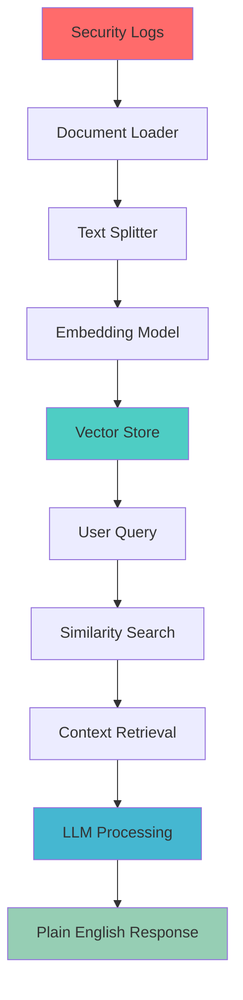
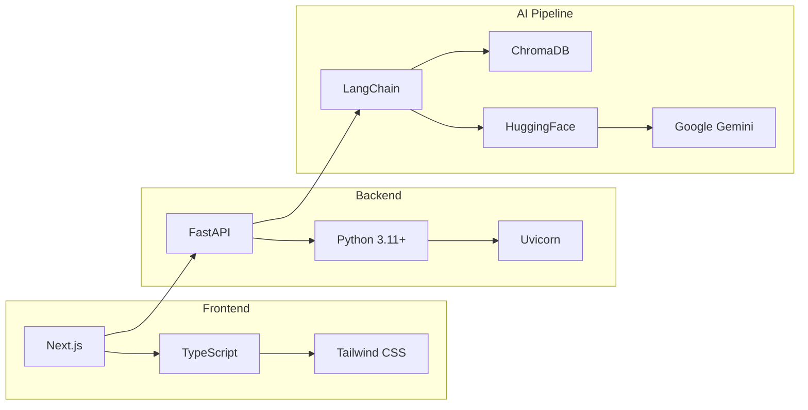

#  Socrates - AI-Powered SOC Assistant


##  What is Socrates?

Socrates is an **AI-driven Security Operations Center (SOC) assistant** designed to democratize cybersecurity analysis. Instead of requiring years of security expertise, Socrates uses **Retrieval-Augmented Generation (RAG)** to help beginners understand security logs, triage alerts, and get actionable insights in plain English.

###  Current Status: Early Development
This is a **proof-of-concept** demonstrating RAG-based log analysis. The system currently:
-  Processes sample security logs using vector embeddings
-  Answers questions about log content using AI
-  Provides a clean web interface for queries
-  **In Progress**: Alert prioritization, real-time log ingestion
-  **Planned**: Multi-source log support, advanced threat detection


## 🔄 How It Works



##  Quick Start

### Prerequisites
- Python 3.11+
- Node.js 18+
- npm/yarn

### 1. Clone & Setup
```bash
git clone https://github.com/curlsmtw/socrates.git
cd socrates
```

### 2. Backend Setup
```bash
# Install Python dependencies
pip install -r req.txt

# Start the FastAPI server
npm run backend
```

### 3. Frontend Setup
```bash
# Install and start Next.js frontend
cd frontend
npm install
cd ..
npm run frontend
```

### 4. Try It Out
- Open http://localhost:3000
- Ask questions like:
  - *"What suspicious activity happened recently?"*
  - *"Are there any failed login attempts?"*
  - *"Summarize the security events"*

##  Current Capabilities

| Feature | Status | Description |
|---------|--------|-------------|
| **Log Analysis** |  Working | Processes security logs via RAG pipeline |
| **AI Q&A** |  Working | Natural language queries about log data |
| **Web Interface** |  Working | Clean, responsive React frontend |
| **Vector Search** |  Working | Semantic similarity matching |
| **Multiple LLMs** |  Working | Support for Gemini, HuggingFace models |
| **Real-time Logs** |  Planned | Live log ingestion and processing |
| **Alert Triage** |  Planned | Priority scoring for security events |
| **Multi-source** |  Planned | Support for various log formats |

##  Project Goals

###  **What I've Achieved**
- Built a functional RAG pipeline for log analysis
- Created an intuitive web interface
- Demonstrated AI-powered security insights
- Modular, extensible architecture

###  **What I'm Working On**
- **Alert Prioritization**: Automatic threat scoring
- **Real-time Processing**: Live log ingestion
- **Enhanced UI**: Better data visualization
- **Performance**: Optimized vector search

##  Tech Stack



## 🔗 Links

- **Documentation**: [docs/design.md](docs/design.md)